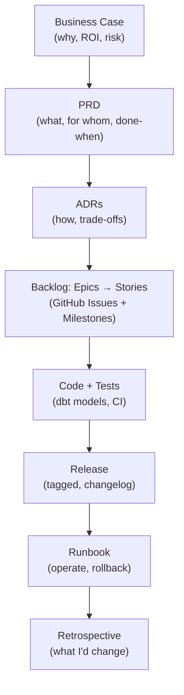

# Delivery Lifecycle: Requirement to Runbook

Anyone can claim they "own the full SDLC." This page is the alternative to claiming it: every stage below links to the actual artifact that stage produced, on Project 1 (Enterprise O2C & MDM Resolution Platform), end to end.

---

## The Trace, Stage by Stage

| Stage | Question It Answers | Artifact |
|---|---|---|
| **1. Business Case** | Why fund this? What's the ROI and the risk of inaction? | [MeridianTrade Platform Transformation](/projects/transformation-business-case/) |
| **2. PRD** | What exactly are we building, for whom, and how do we know it's done? | [PRD: Enterprise O2C & MDM Resolution Platform](/docs/prd/project1-o2c-mdm/) |
| **3. Architecture Decisions** | How is it built, and what did we choose *not* to do? | [ADR-002](/docs/adr/ADR-002-medallion-kimball-over-data-vault/), [ADR-003](/docs/adr/ADR-003-mdm-as-governed-seed/), [ADR-007](/docs/adr/ADR-007-semantic-layer-ratification/), [ADR-011](/docs/adr/ADR-011-irreversible-strangler-cutover/) |
| **4. Agile Backlog** | What's the sequence of delivery, in epics and stories? | [Issues](https://github.com/dchavezf/marts_order_cycle/issues) and [Milestones](https://github.com/dchavezf/marts_order_cycle/milestones) on `marts_order_cycle` |
| **5. Code + Tests** | Does the implementation match the spec, and is it verifiably correct? | [Source](https://github.com/dchavezf/marts_order_cycle) · [CI workflow](https://github.com/dchavezf/marts_order_cycle/blob/main/.github/workflows/dbt-ci.yml) · [Test strategy](https://github.com/dchavezf/marts_order_cycle/blob/main/docs/testing-strategy.md) |
| **6. Release** | What shipped, when, and what changed? | [Releases](https://github.com/dchavezf/marts_order_cycle/releases) |
| **7. Runbook** | How does this run in production, and how do we roll back? | [docs/runbook.md](https://github.com/dchavezf/marts_order_cycle/blob/main/docs/runbook.md) |
| **8. Retrospective** | What worked, what I'd change, what it cost | [Retrospective: Building the O2C & MDM Platform](/posts/retrospective-o2c-mdm-platform/) |

---

## Why This Page Exists

Most portfolios show the spec or the code — rarely the connective tissue between "the business asked for this" and "this is how it runs in production." That connective tissue — PRD discipline, backlog sequencing, release hygiene, honest retrospectives — is what separates an engineer who executes a ticket from one who owns delivery.

Every link above is real and independently verifiable. Nothing on this page is a description of a process; it's a pointer to the artifact that process produced.

*Applies the same discipline described in [How to Review This Portfolio](/portfolio/#how-to-review-this-portfolio).*
