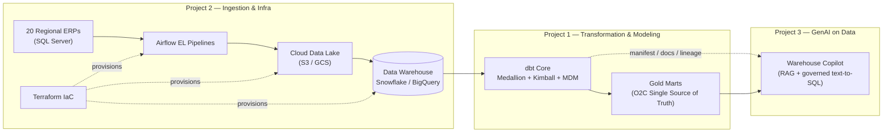

# Daniel Chávez Flores

**Enterprise Data Architect & AI Platform Engineer**

📍 San Luis Potosí, Mexico · 🌎 Remote (Americas) · Open to Senior/Staff/Principal IC roles and B2B contract engagements

Anyone can claim skills on a resume. This portfolio is the **working evidence**: three enterprise-grade data platform projects, each documented business case first, spec second, code third — the way real platforms get built.

---

## Contents

- [Why Talk to Me — the 30-Second Version](#why-talk-to-me--the-30-second-version)
- [The Portfolio: One Platform, Three Disciplines](#the-portfolio-one-platform-three-disciplines)
- [What Each Project Proves](#what-each-project-proves)
- [How to Review This Portfolio](#how-to-review-this-portfolio)
- [Hiring Signals at a Glance](#hiring-signals-at-a-glance)
- [Architecture Decision Records](#architecture-decision-records)
- [Contact](#contact)

---

## Why Talk to Me — the 30-Second Version

22 years in data, the last decade architecting enterprise platforms. Every project here reproduces a class of problem I've already solved in production:

| Proven in Production | Demonstrated Here |
|----------------------|-------------------|
| Architected a **10TB / 20-country Snowflake migration** — zero downtime, **40% operating-cost reduction**, benchmark for **40+ global rollouts** | [Project 1](projects/dbt-o2c-mdm.html): the same multi-region identity, modeling and FinOps problems, in reviewable code |
| **99.9% pipeline SLA** across 3 business domains on a GCP/BigQuery platform with automated quality checks | [Project 2](projects/airflow-iac-pipeline.html): orchestration, data contracts, and IaC discipline that make SLAs enforceable |
| GenAI platform architecture (LLM + RAG pipelines) that **saved 40 engineer-hours/week** by converting 15 manual workflows into governed pipelines | [Project 3](projects/genai-rag-warehouse.html): RAG grounded in warehouse governance, with evals and guardrails |
| Data product discovery and **KPI storytelling for 500+ executives** — requirements to Jira-ready delivery | Every page here: business case first, spec second, code third |

---

## The Portfolio: One Platform, Three Disciplines

Most data portfolios show isolated tutorials on pre-cleaned datasets. This one shows a **coherent enterprise platform** built on deliberately messy, realistic data problems — colliding identifiers, divergent schemas, late-arriving records.

All three projects operate on the same fictional company — **MeridianTrade Group**, a multinational consumer-goods distributor running 20 disjointed regional ERP systems — and together they form its complete data platform:

One data universe, three architectural disciplines. A hiring manager can trace a single order record from ERP extraction to a natural-language answer.

---

## What Each Project Proves

| # | Project | Business Problem | Skills Demonstrated | Core Stack |
|---|---------|------------------|---------------------|------------|
| 1 | [Enterprise O2C & MDM Resolution Platform](projects/dbt-o2c-mdm.html) | 20 ERPs with colliding identifiers and divergent models; no single source of truth for Order-to-Cash | Dimensional modeling (Kimball), Medallion architecture, MDM/identity resolution, SCD2 snapshots, incremental strategies, FinOps, data quality testing | dbt Core, Snowflake/BigQuery, SQL, Jinja |
| 2 | [Multi-Source Ingestion Platform with IaC](projects/airflow-iac-pipeline.html) | Manual, undocumented extraction from 20 sources; environments built by hand; no observability | Orchestration design, idempotent EL patterns, infrastructure-as-code, CI/CD, environment parity, data contracts, alerting | Airflow, Terraform, Python, S3/GCS, GitHub Actions |
| 3 | [Warehouse Copilot — GenAI over Governed Data](projects/genai-rag-warehouse.html) | 500+ analysts can't find or trust data; tribal knowledge locked in a few engineers | RAG architecture, retrieval over structured metadata, governed text-to-SQL, LLM evaluation, guardrails, cost control | Python, Claude API, dbt artifacts (manifest/catalog), vector search |

Every project page explicitly answers the five questions a reviewer needs: **the business problem, the tools used, the methodology, where the code lives, and the quantified outcome.**

---

## How to Review This Portfolio

1. Skim this page for the map — you're almost done with that.
2. Open any project and read its **90-second executive summary** — business language, quantified stakes.
3. Read the **methodology and architecture decisions** if you want the engineering judgment.
4. Then read the code (repos linked from each project as they go live) knowing exactly what it's supposed to do — the way specs are meant to work.

---

## Hiring Signals at a Glance

- **Experience:** 22 years in data; current title Senior Data Solutions Architect & AI Platform Engineer (Infovision); previously TCS and independent B2B consulting.
- **Certifications:** GitHub Copilot, GitHub Foundations (2025) — AI-native engineering workflow in daily practice.
- **Working style:** spec-first (reduced engineering rework 60% by establishing a Spec-First culture — this portfolio practices it), C-suite-fluent, radical transparency on trade-offs.
- **Availability:** remote-first, Americas time zones; open to full-time senior IC roles or contractor-based B2B partnerships.

### Strategic Stack by Capability

| Capability | Tools & Expertise |
|------------|-------------------|
| **Data Modeling & Governance** | Snowflake · BigQuery · dbt Core · Kimball / Data Vault 2.0 · MDM · Data Contracts · FinOps |
| **Orchestration & Infrastructure** | Apache Airflow · Terraform · Docker · GitHub Actions · CI/CD |
| **AI-Augmented Development** | Claude API · GitHub Copilot · RAG pipelines · LLM evaluation & guardrails |
| **Languages & Query** | SQL · Python · Jinja · Bash |
| **Cloud Platforms** | GCP (BigQuery, GCS, Cloud Composer) · AWS (S3, Redshift) · Snowflake |
| **Data Quality & Observability** | dbt tests · Great Expectations · SLA monitoring · alerting |

---

## Architecture Decision Records

Every significant technical choice in this portfolio is documented as a formal ADR in [`/docs/adr/`](docs/adr/). These records explain the *why* behind each decision — the trade-offs, the alternatives considered, and the consequences accepted:

| ADR | Decision | Project |
|-----|----------|---------|
| [ADR-001](docs/adr/ADR-001-elt-over-etl.md) | ELT (transform in-warehouse) over ETL | Project 1 |
| [ADR-002](docs/adr/ADR-002-medallion-kimball-over-data-vault.md) | Medallion + Kimball over Data Vault 2.0 | Project 1 |
| [ADR-003](docs/adr/ADR-003-mdm-as-governed-seed.md) | Governed seed MDM over probabilistic entity resolution | Project 1 |
| [ADR-004](docs/adr/ADR-004-config-driven-dag-factory.md) | Config-driven DAG factory over hand-written DAGs | Project 2 |
| [ADR-005](docs/adr/ADR-005-gold-whitelist-sql-guard.md) | Gold whitelist SQL guard over open generation | Project 3 |
| [ADR-006](docs/adr/ADR-006-deterministic-lineage-over-llm-generation.md) | Deterministic lineage traversal over LLM generation | Project 3 |

---

## Contact

The fastest way to reach me:

- 💼 **LinkedIn:** [mx.linkedin.com/in/dchavezf](https://mx.linkedin.com/in/dchavezf)
- 📧 **Email:** [dchavezf@gmail.com](mailto:dchavezf@gmail.com)
- 🐙 **GitHub:** [github.com/dchavezf](https://github.com/dchavezf)

I'm happy to walk through any design decision in these documents live — that conversation is the best interview either of us can get.
