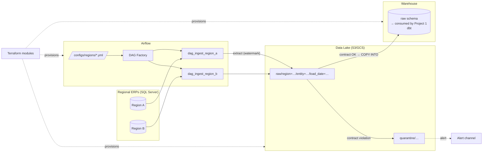

# Multi-Source Ingestion Platform with Infrastructure-as-Code

> **Portfolio project 2 of 3** · [← Portfolio home](/portfolio/) · Previous: [dbt O2C & MDM](/projects/dbt-o2c-mdm/) · Next: [Warehouse Copilot →](/projects/genai-rag-warehouse/)
>
> **Stack:** Apache Airflow · Terraform · Python · S3/GCS · Snowflake/BigQuery · GitHub Actions
> **Business case:** [MeridianTrade Platform Transformation](/projects/transformation-business-case/)
>
> **Code repository:** 🚧 *implementation in progress — spec-first, the design below is the contract the code will be verified against*

## Contents

- [Executive Summary (90 seconds)](#executive-summary-90-seconds)
- [1 · What Business Problem Does This Solve?](#1--what-business-problem-does-this-solve)
- [2 · What Tools and Skills Does It Use?](#2--what-tools-and-skills-does-it-use)
- [3 · What Is the Methodology?](#3--what-is-the-methodology)
- [4 · Where Is the Code and Evidence?](#4--where-is-the-code-and-evidence)
- [5 · What Are the Quantified Outcomes?](#5--what-are-the-quantified-outcomes)
- [What This Demonstrates About Me](#what-this-demonstrates-about-me)
- [Contact](#contact)

---

## Executive Summary (90 seconds)

[Project 1](/projects/dbt-o2c-mdm/) assumed raw ERP data "arrives" in the warehouse. In real enterprises, that assumption is where projects die: extraction is a pile of undocumented scripts on someone's VM, environments are hand-built and drift apart, and the first sign of a broken feed is an executive asking why yesterday's numbers are missing.

This project builds the **ingestion and infrastructure layer** for MeridianTrade Group: Airflow-orchestrated, idempotent EL pipelines that replicate 20 regional SQL Server ERPs into a cloud data lake and load them into the warehouse — with **every piece of infrastructure defined in Terraform**, promoted through identical dev/staging/prod environments by CI/CD.

Within the [MeridianTrade business case](/projects/transformation-business-case/), this project implements the ingestion foundation, infrastructure-as-code controls, and data-contract boundary that make downstream governance credible.

---

## 1 · What Business Problem Does This Solve?

MeridianTrade's 20 ERPs are extracted today by a mix of SSIS packages, cron jobs and manual CSV exports, owned by whoever set them up. Group IT's audit found: no central schedule, no retry policy, three different credential-storage practices (including plaintext), and no way to say with confidence *when* each region's data last landed.

- **Trust starts at ingestion.** Every governance claim downstream (lineage, SLAs, audited numbers) is fiction if the load layer is unmanaged.
- **Speed of onboarding is the migration's critical path.** The difference between "a region takes a sprint" and "a region takes an afternoon" decides whether the two-quarter, 20-country mandate is met.
- **Auditability is contractual.** Finance data flows must show who changed what infrastructure, when — which is exactly what IaC + git history provides and hand-built consoles never will.

| Problem | Cost of Inaction | Outcome Delivered |
|---------|------------------|-------------------|
| Hand-built environments that drift | Weeks lost reproducing "works in dev" failures | `terraform apply` recreates any environment in minutes, from code-reviewable definitions |
| Cron-and-script extraction with no retries | Silent data gaps discovered days later by business users | Orchestrated DAGs with retries, SLAs, freshness checks and alerting — failures page engineers, not executives |
| Per-source bespoke pipelines | Each new region = new engineering project | Config-driven ingestion: onboarding region 3–20 is a YAML entry, not new code |
| No contract between ingestion and transformation | Schema changes upstream silently break dbt models downstream | Data contracts validated at load time; breaking changes quarantined, not propagated |

---

## 2 · What Tools and Skills Does It Use?

| Category | Tools & Techniques |
|----------|--------------------|
| Orchestration | **Apache Airflow** — config-driven DAG factory, retries with backoff, SLAs, freshness sensors, alerting callbacks |
| Infrastructure | **Terraform** — reusable modules (storage, warehouse, secrets, alerting) with dev/staging/prod tfvars; drift detection |
| Extraction | **Python** — incremental watermark extraction from SQL Server (CDC documented as upgrade path) |
| Lake & warehouse | Partitioned **Parquet** on S3/GCS (MinIO locally) → `COPY INTO` **Snowflake/BigQuery** `raw` schema |
| Quality gates | **Data contracts** — versioned YAML schemas validated between land and load; violations quarantined + alerted |
| CI/CD | **GitHub Actions** — `terraform plan` on PR, DAG parse validation, unit tests, secret scan, staged promotion with destructive-change guard |

---

## 3 · What Is the Methodology?

A **config-driven ingestion platform**, not 20 pipelines:

- **One parametrized DAG factory:** each region is a YAML config (connection ref, entities, schedule, SLA). Airflow generates per-region DAGs from config; pipeline logic exists once. DAG shape per region: `extract → validate_contract → load → freshness_check`, entities in parallel, regions fully independent.
- **Idempotency by design:** incremental extraction by watermark → partition-overwrite Parquet → deterministic re-load. Re-running any window produces identical final state; backfills are safe by construction.
- **Data contracts at the boundary:** expected schema per entity validated at load; additive changes load with a warning, breaking changes quarantine the batch and alert — zero corrupt rows reach the `raw` schema Project 1 consumes.
- **Everything provisioned by Terraform:** buckets, warehouse databases/schemas/roles, secrets, alert channels. Staging and prod differ only in tfvars. No credentials in code or the Airflow UI.
- **CI/CD:** PRs run `terraform plan` + DAG validation + unit tests; merge applies to staging and runs a kill-and-rerun idempotency test; tagged releases promote to prod behind a manual gate; plans containing resource destruction require an explicit PR label.

### Architecture decisions and trade-offs

| Decision | Alternative Considered | Why This Choice |
|----------|------------------------|-----------------|
| Self-managed Airflow (MWAA/Composer pattern documented) | Managed ELT SaaS (Fivetran/Airbyte) | SaaS is the right call in many engagements — and the docs say so — but the portfolio must demonstrate orchestration engineering, and licensed connectors for 20 ERPs at 10TB have real cost curves worth challenging |
| Config-driven DAG factory | One hand-written DAG per region | 20 near-identical DAGs is unmaintainable; config-driven is how region-per-afternoon onboarding is met |
| Watermark incremental extraction | Full nightly dumps | Full dumps move 10TB nightly; watermarks bound cost and runtime. CDC documented as the upgrade path |
| Terraform | Manual console setup + runbooks | Environments as reviewable code — and this repo deliberately closes the IaC gap in my profile, in public |
| Parquet lake as durable staging | Load directly source → warehouse | The lake decouples extraction from loading, enables replay/backfill without re-hitting production ERPs, keeps raw history cheap |

---

## 4 · Where Is the Code and Evidence?

**Status: 🚧 implementation in progress** (Phase 2 of the portfolio roadmap; consumes Project 1's source expectations). Publicly reviewable today: this business case and the full technical spec — functional requirements, failure-handling matrix, CI/CD design, and acceptance criteria.

The repository will ship: the DAG factory and unit-tested task library, region configs, versioned data contracts, Terraform modules with three environment definitions, dockerized local demo (Airflow + MinIO + seeded SQL Server containers), GitHub Actions workflows, and an operations runbook (backfill, quarantine triage, credential rotation, environment rebuild).

**Definition of done** (verifiable): `terraform apply` provisions everything from zero with no console steps; kill-and-rerun test yields identical row counts and checksums; region-3 onboarding executed with only a new YAML file, timed under 1 hour; a simulated breaking schema change is quarantined with an alert; CI blocks broken DAGs, failed tests, invalid Terraform and unlabeled destructive plans.

---

## 5 · What Are the Quantified Outcomes?

Modeled on the production platform this reproduces (a GCP/BigQuery estate where I ran 99.9% pipeline SLA across 3 business domains):

- **Region onboarding drops from a sprint to under one hour** — a YAML entry instead of an engineering project; the 20-country mandate becomes arithmetic instead of hope.
- **Environment rebuild in minutes, not weeks:** any environment reproducible by `terraform apply` from reviewed code — the class of change that took "works in dev" incidents off my production pager.
- **Zero corrupt rows propagate downstream:** contract violations are quarantined at the boundary with a schema diff in the alert, instead of poisoning executive dashboards.
- **Extraction volume proportional to daily change rate, not table size** — watermark incrementality bounds cost on a 10TB estate.

---

## What This Demonstrates About Me

- I build **platforms, not pipelines** — the 20th source must be cheaper than the 2nd, or the architecture failed.
- I treat **infrastructure as a deliverable**: reproducible environments are a feature the business pays for in reduced incidents and faster onboarding.
- I know **when to buy vs build** — the docs honestly frame where a managed ELT tool wins, which is the judgment hiring managers actually want.
- I'm closing my own skill gaps **in public**: this project exists partly because Terraform was flagged as a gap in my profile analysis.

---

## Contact

- 💼 **LinkedIn:** [mx.linkedin.com/in/dchavezf](https://mx.linkedin.com/in/dchavezf)
- 📧 **Email:** [dchavezf@gmail.com](mailto:dchavezf@gmail.com)
- 🐙 **GitHub:** [github.com/dchavezf](https://github.com/dchavezf)

*Next in the platform: [Project 3 — Warehouse Copilot: GenAI over Governed Data →](/projects/genai-rag-warehouse/)*

