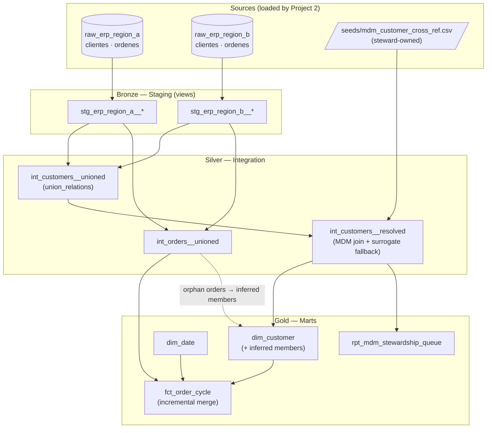

# Enterprise Order-to-Cash & MDM Resolution Platform

> **Portfolio project 1 of 3** · [← Portfolio home](/portfolio/) · Next: [Ingestion Platform with IaC →](/projects/airflow-iac-pipeline/)
>
> **Stack:** dbt Core · Snowflake / BigQuery · SQL · Jinja macros
> **Business case:** [MeridianTrade Platform Transformation](/projects/transformation-business-case/)
>
> **Code repository:** [github.com/dchavezf/marts_order_cycle](https://github.com/dchavezf/marts_order_cycle)

## Contents

- [Executive Summary (90 seconds)](#executive-summary-90-seconds)
- [1 · What Business Problem Does This Solve?](#1--what-business-problem-does-this-solve)
- [2 · What Tools and Skills Does It Use?](#2--what-tools-and-skills-does-it-use)
- [3 · What Is the Methodology?](#3--what-is-the-methodology)
- [4 · Where Is the Code and Evidence?](#4--where-is-the-code-and-evidence)
- [5 · What Are the Quantified Outcomes?](#5--what-are-the-quantified-outcomes)
- [What This Demonstrates About Me](#what-this-demonstrates-about-me)
- [Contact](#contact)

---

## Executive Summary (90 seconds)

MeridianTrade Group, a fictional multinational consumer-goods distributor, runs **20 regional ERP systems** that were never designed to talk to each other. Customer IDs collide across countries, data models diverge, and the executive team cannot answer a basic question — *"what is our real Order-to-Cash cycle time, globally?"* — without weeks of manual reconciliation.

This project is the **transformation engine** that fixes that: a dbt Core project implementing a Medallion architecture (Bronze/Silver/Gold) with Kimball dimensional modeling and a governed Master Data Management (MDM) layer, delivering a unified, tested, cost-optimized Single Source of Truth for 500+ business users.

Within the [MeridianTrade business case](/projects/transformation-business-case/), this project implements the governed transformation, MDM, Gold-layer consumption, and finance-facing trust layer required after ingestion is under control.

---

## 1 · What Business Problem Does This Solve?

MeridianTrade grew by acquisition. Each country kept its ERP (all SQL Server-based, but with local schemas, local customer numbering, and local business rules). Group finance consolidates Order-to-Cash manually in spreadsheets. Symptoms:

- **Identity collision:** customer `1001` in Mexico is Grupo Salinas; customer `1001` in Colombia is a hardware store. Naive unions double-count or mis-attribute revenue.
- **Model divergence:** "order date" means booking date in some regions, shipping date in others.
- **No lineage or trust:** when a number looks wrong, nobody can trace where it came from.
- **Scale pressure:** a 10TB+ estate and a mandate to onboard all 20 countries within two quarters.

Order-to-Cash is where working capital lives. A consolidated, trustworthy O2C view enables **working capital optimization** (identify regions with abnormal order-to-invoice lag), **credit risk consolidation** (one customer, one exposure figure across all subsidiaries), and **operational benchmarking** on identical definitions.

| Problem | Cost of Inaction | Outcome Delivered |
|---------|------------------|-------------------|
| Colliding customer identifiers across 20 regions | Duplicate credit exposure; misstated receivables | Deterministic identity resolution via governed MDM cross-reference, zero dropped orphans |
| Full-refresh fact rebuilds every night | Warehouse compute scales linearly with history | Incremental merge strategy — **up to 40% compute reduction** on heavy facts |
| No history of customer master changes | Compliance risk when Tax IDs (RFC/NIT) change | SCD Type 2 tracking via dbt snapshots |
| Untested transformations | Silent data corruption reaching executive dashboards | Relationship, uniqueness and not-null tests enforced across the Gold layer |

---

## 2 · What Tools and Skills Does It Use?

| Category | Tools & Techniques |
|----------|--------------------|
| Transformation | **dbt Core** — models, seeds, snapshots, macros, tests, docs |
| Warehouse | **Snowflake** (primary) with **BigQuery** portability via adapter-dispatched macros; DuckDB for zero-cost local development |
| Modeling | **Kimball dimensional modeling** (star schema), **Medallion architecture** (Bronze/Silver/Gold), **SCD Type 2** history |
| Data governance | **MDM identity resolution** with steward-owned cross-reference, stewardship queue, full lineage keys |
| Cost engineering | **FinOps**: incremental `merge` materializations with late-update lookback windows |
| Quality | `unique`, `not_null`, `relationships`, `accepted_values` schema tests + custom data tests, CI-enforced |
| Languages | SQL, Jinja |

---

## 3 · What Is the Methodology?

An ELT platform where **all transformation happens inside the warehouse**, version-controlled and tested like software:

- **Bronze/Staging** — one standardized staging model per source entity; types cast, columns renamed, nothing lost. Every row carries a `customer_lineage_key` (`region|source_system|natural_id`) guaranteeing global uniqueness pre-MDM and full traceability post-MDM.
- **Silver/Integration** — dynamic consolidation of all regions via `dbt_utils.union_relations()` (no hand-maintained 20-way `UNION ALL`), plus identity resolution against the MDM cross-reference.
- **Gold/Marts** — Kimball star schema: `dim_customer`, `dim_date`, `fct_order_cycle` with cycle-time measures (`days_order_to_ship`, `days_invoice_to_cash`, …), ready for BI consumption.
- **Governance built in** — the MDM cross-reference is a **dbt seed** maintained by data stewards: business-owned mapping, engineering-owned pipeline. Unmapped customers are never dropped; they receive a deterministic surrogate identity and surface in a stewardship queue. Late-arriving orders generate **inferred member** placeholder rows, so referential integrity always holds and self-heals on the next MDM sync.

### Architecture decisions and trade-offs

| Decision | Alternative Considered | Why This Choice |
|----------|------------------------|-----------------|
| ELT (transform in-warehouse) over ETL | Spark-based ETL before load | Warehouse compute is elastic; dbt gives testing, docs and lineage for free; team skill profile is SQL-first |
| Medallion + Kimball hybrid | Pure Data Vault 2.0 | DV2 adds insurance the use case doesn't need yet; Kimball marts are what 500 BI users actually consume |
| MDM as governed seed | Probabilistic ML entity resolution | Deterministic + steward-owned is auditable and explainable to finance; probabilistic matching is a Phase 2 enhancement, not a foundation |
| Incremental merge on facts | Nightly full refresh | Full refresh cost scales with history; merge handles late-updating statuses (backorders, credit notes) correctly |
| Inferred members for late-arriving facts | Reject/quarantine orphan orders | Orders arriving before customer master sync is *normal* in multi-region replication; placeholders preserve integrity and self-heal |

---

## 4 · Where Is the Code and Evidence?

**Status: ✅ Live production-ready code.** The complete implementation is publicly reviewable:

- **Code Repository:** [github.com/dchavezf/marts_order_cycle](https://github.com/dchavezf/marts_order_cycle)
- This repo contains the full dbt project, seeds for MDM customer cross-referencing, standard and custom data quality tests, incremental and merge materialization strategies, and SCD Type 2 history snapshots.

**Definition of done** (verifiable, not vibes): `dbt build` runs green with zero test failures; incremental runs process deltas only; data lineage and documentation are auto-generated.

---

## 5 · What Are the Quantified Outcomes?

Modeled on the real Fortune 500 engagement this project reproduces (a 10TB / 20-country Snowflake migration I architected):

- **Up to 40% warehouse compute reduction** on heavy fact tables via incremental merge vs nightly full refresh — measured and documented per run in the FinOps log.
- **Zero dropped customer records:** every unmapped identity gets a deterministic surrogate and appears in the stewardship queue — auditable governance instead of silent data loss.
- **Onboarding a new region is a 5-step checklist, not a refactor** — the difference between hitting a two-quarter, 20-country mandate or not.
- **One trustworthy O2C cycle-time figure** for 500+ business users, with column-level lineage answering "where did this number come from?" in seconds instead of weeks.

---

## What This Demonstrates About Me

- I design for the **20-source future**, not the 2-source demo — scaling is a checklist, not a refactor.
- I treat **governance as architecture**, not paperwork: MDM ownership, stewardship queues, and auditability are built into the data flow.
- I optimize for **cost as a first-class requirement** (FinOps), because in real engagements the warehouse bill is a stakeholder.
- I document decisions with trade-offs, because senior engineering is choosing what *not* to build.

---

## Contact

- 💼 **LinkedIn:** [mx.linkedin.com/in/dchavezf](https://mx.linkedin.com/in/dchavezf)
- 📧 **Email:** [dchavezf@gmail.com](mailto:dchavezf@gmail.com)
- 🐙 **GitHub:** [github.com/dchavezf](https://github.com/dchavezf)

*Next in the platform: [Project 2 — Multi-Source Ingestion Platform with IaC →](/projects/airflow-iac-pipeline/)*
