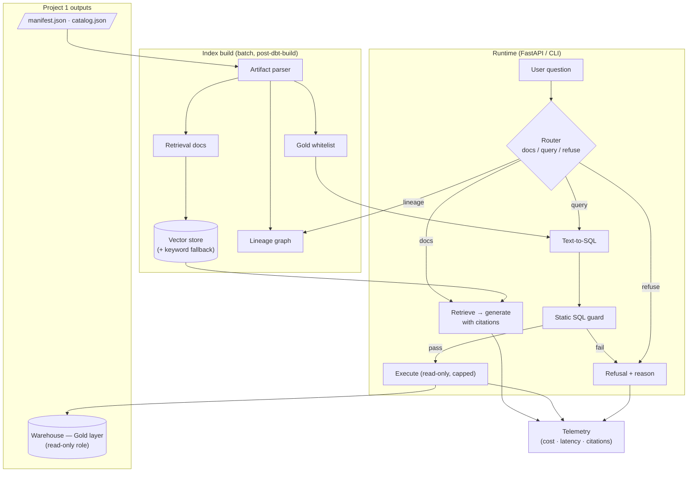

# Warehouse Copilot — GenAI over Governed Data

> **Portfolio project 3 of 3** · [← Portfolio home](/portfolio/) · Previous: [Ingestion Platform with IaC](/projects/airflow-iac-pipeline/)
>
> **Stack:** Python · Claude API · dbt artifacts (manifest/catalog) · vector search · FastAPI
> **Business case:** [MeridianTrade Platform Transformation](/projects/transformation-business-case/)
>
> **Code repository:** [github.com/dchavezf/genai-rag-warehouse](https://github.com/dchavezf/genai-rag-warehouse)

## Contents

- [Executive Summary (90 seconds)](#executive-summary-90-seconds)
- [1 · What Business Problem Does This Solve?](#1--what-business-problem-does-this-solve)
- [2 · What Tools and Skills Does It Use?](#2--what-tools-and-skills-does-it-use)
- [3 · What Is the Methodology?](#3--what-is-the-methodology)
- [4 · Where Is the Code and Evidence?](#4--where-is-the-code-and-evidence)
- [5 · What Are the Quantified Outcomes?](#5--what-are-the-quantified-outcomes)
- [What This Demonstrates About Me](#what-this-demonstrates-about-me)
- [Contact](#contact)

---

## Executive Summary (90 seconds)

MeridianTrade now has a governed warehouse ([Project 1](/projects/dbt-o2c-mdm/)) fed by reliable pipelines ([Project 2](/projects/airflow-iac-pipeline/)). A new problem emerges — the one every mature data platform hits: **500+ business users can't find, understand, or trust the data without asking an engineer.** "Which table has customer credit exposure?" "Does `days_order_to_cash` include weekends?" Each question interrupts the data team; each unanswered one breeds shadow spreadsheets.

Warehouse Copilot is a **RAG assistant grounded in the platform's own governance artifacts** — dbt's manifest, catalog, lineage graph, and column documentation — plus a **governed text-to-SQL** mode that answers business questions by querying only approved Gold-layer models, showing its SQL, and refusing what it cannot verify.

Within the [MeridianTrade business case](/projects/transformation-business-case/), this project implements the governed discovery layer: AI access that reduces support burden without allowing the model to invent lineage, definitions, or unsafe SQL.

---

## 1 · What Business Problem Does This Solve?

The platform's dbt project documents every Gold model and column (a Project 1 acceptance criterion). But documentation nobody reads is inventory, not an asset. Analysts don't browse docs sites; they ask people. Meanwhile, leadership wants "AI on our data" — and the dangerous default is a demo that lets an LLM freestyle SQL against production.

| Problem | Cost of Inaction | Outcome Delivered |
|---------|------------------|-------------------|
| Data discovery via Slack-an-engineer | Data team loses ~20% capacity to interruptions; analysts wait hours | Self-service answers grounded in dbt docs, with lineage citations |
| Tribal knowledge concentration | Bus-factor risk; onboarding an analyst takes weeks | The documentation *is* the knowledge base — and Copilot makes it queryable |
| Ungoverned LLM+SQL experiments | Hallucinated joins, wrong numbers presented confidently to executives | Text-to-SQL constrained to documented Gold models, read-only role, SQL always shown, evals gating every release |

---

## 2 · What Tools and Skills Does It Use?

| Category | Tools & Techniques |
|----------|--------------------|
| LLM | **Claude API** (Sonnet-class), versioned prompts and few-shots, prompt caching for static schema context |
| Grounding | **dbt artifacts** (`manifest.json` + `catalog.json`) → retrieval documents with stable citation IDs; lineage answered by **deterministic graph traversal**, not generation |
| Retrieval | **Vector search** with a keyword fallback mode (repo runnable without paid embedding keys) |
| Safety engineering | Mode router (docs / query / refuse), **static SQL guard** (sqlglot parse, single-SELECT, whitelist, enforced LIMIT), read-only role, timeout and scan caps |
| Evaluation | Offline **eval suites as CI release gates**: grounding, lineage, query correctness, adversarial refusals |
| App & telemetry | **Python**, **FastAPI** + CLI; per-interaction cost/latency/citation logging and a published cost model |

---

## 3 · What Is the Methodology?

Two answer modes behind one interface, both grounded and auditable:

- **Docs mode (RAG):** questions about *the platform* retrieve from an index built out of dbt's manifest and catalog (model/column descriptions, tests, lineage edges, freshness SLAs). Every answer cites the models/columns it used; below a retrieval-confidence threshold, the system says it doesn't know.
- **Lineage questions** ("what feeds X?", "what breaks if I change Y?") are answered by **graph traversal over the manifest DAG — deterministic, not generated** — with the LLM only narrating the result.
- **Query mode (governed text-to-SQL):** business questions generate SQL **restricted to a whitelist of documented Gold models**, statically checked (single SELECT, no DML/DDL, whitelisted relations only, LIMIT enforced) and executed under a read-only role with timeout and scan caps. The SQL and result are always shown — the user never gets a number without the query that produced it.
- **Refusal as a feature:** out-of-scope requests (writes, raw-layer access, ungrounded topics) are declined with an explanation and an escalation path. A prompt-injection attempt can, at worst, produce a SELECT on Gold models already visible to the user — **the blast radius is the design**.

### Architecture decisions and trade-offs

| Decision | Alternative Considered | Why This Choice |
|----------|------------------------|-----------------|
| Ground in dbt artifacts | Crawl warehouse `information_schema` | dbt artifacts carry human-written semantics, tests and lineage — the *meaning*, not just the shape; also proves the Project 1→3 integration story |
| Two explicit modes with a router | One do-everything agent | Explicit modes make grounding, permissions and evals tractable; agents that guess their own scope are how demos hurt people |
| Gold whitelist, read-only, cost-capped SQL | Open SQL generation over the warehouse | Blast-radius control is the design; the constraint is what makes it deployable in an enterprise |
| Always show the SQL | Hide it for "simplicity" | Auditability builds trust with analysts and satisfies the governance posture |
| Offline eval suite gating releases | Vibes-based iteration | LLM behavior regresses silently; treating prompts like code (versioned, tested, gated) is the discipline being demonstrated |

---

## 4 · Where Is the Code and Evidence?

**Status: live implementation with technical documentation.** The repository is publicly reviewable and includes dbt artifact fixtures, typed artifact parsing, Gold model whitelisting, deterministic lineage graph traversal, retrieval, docs/query/refusal modes, SQL guardrails, DuckDB execution, FastAPI endpoints, CLI modes, telemetry hooks, Docker, CI workflows, and tests.

- **Code repository:** [github.com/dchavezf/genai-rag-warehouse](https://github.com/dchavezf/genai-rag-warehouse)
- **Portfolio brief:** [docs/portfolio-brief.md](https://github.com/dchavezf/genai-rag-warehouse/blob/main/docs/portfolio-brief.md)
- **Architecture:** [docs/architecture.md](https://github.com/dchavezf/genai-rag-warehouse/blob/main/docs/architecture.md)
- **Evaluation methodology:** [docs/eval-methodology.md](https://github.com/dchavezf/genai-rag-warehouse/blob/main/docs/eval-methodology.md)
- **Cost model:** [docs/cost-model.md](https://github.com/dchavezf/genai-rag-warehouse/blob/main/docs/cost-model.md)
- **Reviewer guide:** [docs/reviewer-guide.md](https://github.com/dchavezf/genai-rag-warehouse/blob/main/docs/reviewer-guide.md)

**Definition of done** (verifiable): the repository runs locally without external LLM keys by default; tests cover the core safety behavior; `pytest`, `ruff`, and eval checks are documented as quality gates; the README reports `30 passed`, `ruff: All checks passed`, and `evals: 2 passed` for the current local verification.

---

## 5 · What Are the Quantified Outcomes?

Modeled on the GenAI platform work this reproduces (LLM + RAG pipelines that saved **40 engineer-hours/week** by converting 15 manual workflows into governed pipelines):

- **~20% of data-team capacity reclaimed** by deflecting routine discovery questions to grounded self-service answers.
- **Zero fabricated tables or columns** in benchmark runs — every identifier verified against the catalog, every claim traceable to a retrieved artifact.
- **100% refusal of out-of-scope requests** (writes, raw-layer access, undocumented models) on the adversarial eval set — enforced in CI on every release.
- **Bounded, published cost per 1,000 queries**, with prompt caching savings measured in telemetry — AI features with a P&L, not a demo.

---

## What This Demonstrates About Me

- **GenAI applied to data platforms** — my differentiator positioning — with governance as the load-bearing design element, not an afterthought.
- I understand that in enterprise AI, **what the system refuses to do is as important as what it does**.
- I evaluate LLM systems like software: versioned prompts, regression suites, release gates — not demos.
- The three-project arc closes: pipelines feed models, models carry semantics, semantics power AI. That's a platform architect's view of GenAI.

---

## Contact

- 💼 **LinkedIn:** [mx.linkedin.com/in/dchavezf](https://mx.linkedin.com/in/dchavezf)
- 📧 **Email:** [dchavezf@gmail.com](mailto:dchavezf@gmail.com)
- 🐙 **GitHub:** [github.com/dchavezf](https://github.com/dchavezf)

*Back to the map: [Portfolio home](/portfolio/)*

