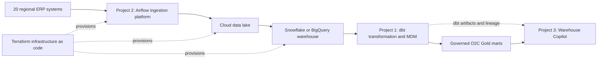

# Business Case: MeridianTrade Platform Transformation

> **Portfolio context:** [One platform, three disciplines](/portfolio/)  
> **Sponsor audience:** CEO, CFO, CTO, Audit Committee  
> **Decision owner:** Daniel Chavez Flores  
> **Status:** Portfolio reference case  
> **Date:** 2026-07-08

## Executive Summary

MeridianTrade Group is a fictional multinational consumer-goods distributor with 20 regional ERP systems, 10TB+ of financial and operational data, and 500+ business users who need one trusted answer instead of twenty local interpretations.

The company is not suffering from a dashboard problem. It is operating with a structural trust problem: customer identifiers collide across countries, revenue definitions vary by region, ingestion is maintained through undocumented scripts, and executive reporting depends on reconciliation labor instead of governed data.

This business case is the foundation for the three portfolio projects:

1. [Project 2 - Multi-Source Ingestion Platform with IaC](/projects/airflow-iac-pipeline/) creates reliable, observable ingestion from the 20 regional ERPs.
2. [Project 1 - Enterprise O2C & MDM Resolution Platform](/projects/dbt-o2c-mdm/) turns raw regional data into governed Order-to-Cash facts, MDM identity resolution, and Gold-layer business marts.
3. [Project 3 - Warehouse Copilot](/projects/genai-rag-warehouse/) makes governed data discoverable through controlled GenAI, grounded in dbt artifacts, lineage, and safe SQL guardrails.

The investment is justified because the current operating model creates recurring financial, operational, and governance risk. The target outcome is not cloud adoption. The target outcome is a reusable data operating system: business definitions ratified up front, pipelines managed as code, transformations tested like software, and executive metrics traceable from source system to boardroom.

## Current State

MeridianTrade grew by acquisition. Each country kept its SQL Server-based ERP, local customer numbering, local reporting rules, and local finance workarounds. The result is a platform where multiple teams can produce numbers that are locally correct but globally incompatible.

The legacy environment has five structural failures:

- **Definition gap:** Mexico, Costa Rica, the U.S. corporate team, and other entities can apply different but defensible revenue definitions.
- **Serialized processing:** Regional pipelines run through fragile scheduling and legacy integration patterns, producing an eight-hour processing window and dependency on the slowest entity.
- **Weak audit reconstruction:** When a number is challenged, lineage depends too heavily on manual investigation and the memory of the original implementer.
- **Hidden business logic:** Legitimate financial adjustments live in personal scripts, SQL Agent jobs, spreadsheets, and tribal knowledge outside formal governance.
- **False safety from legacy continuity:** Keeping the old platform alive after cutover preserves a competing source of truth and recreates the ambiguity the program exists to remove.

## Business Problem

The board-level question is simple: **which number is the company prepared to sign?**

Today, answering that question consumes too much finance capacity and too much engineering attention. Month-end close becomes reconciliation labor. Regional teams build shadow models when the central platform cannot represent local regulatory reality. SOX audit defense requires explanation instead of evidence. Infrastructure cost remains tied to always-on legacy capacity, while cloud modernization efforts risk becoming faster ambiguity if definitions are not settled first.

The existing model does not survive the next stage of delivery because scale increases the cost of ambiguity. More entities, more schemas, more regulations, and more users make the platform less trustworthy unless the operating model changes.

## Proposed Investment

Approve a governed modernization program with six architectural commitments:

1. Ratify enterprise data definitions before migration and transformation work begins.
2. Move ingestion and analytics to decoupled compute and storage, using cloud object storage and Snowflake/BigQuery-compatible warehouse patterns.
3. Use Medallion architecture with Kimball-style Gold models for business consumption, while preserving raw evidence and lineage through Bronze and Silver layers.
4. Build a version-controlled data factory using Airflow, Terraform, dbt, Great Expectations, and CI/CD.
5. Convert institutional knowledge from legacy experts into governed data contracts, tests, models, and runbooks.
6. Execute a strangler migration with parity gates, then retire the legacy estate as a competing production source.

## Platform Scope

This is one data universe, not three isolated demos. The same order record can be traced from ERP extraction, through governed transformation, into a natural-language answer with deterministic lineage.

## ADR Traceability

| ADR | Decision | Business Rationale |
|-----|----------|--------------------|
| [ADR-001](/docs/adr/ADR-001-elt-over-etl/) | ELT over ETL | Uses warehouse compute where it is elastic, testable, and closer to governed transformation logic. |
| [ADR-002](/docs/adr/ADR-002-medallion-kimball-over-data-vault/) | Medallion + Kimball over Data Vault 2.0 | Prioritizes BI usability and delivery speed while keeping raw evidence and lineage intact. |
| [ADR-003](/docs/adr/ADR-003-mdm-as-governed-seed/) | Governed seed MDM over probabilistic entity resolution | Makes identity resolution auditable to finance instead of probabilistic and opaque. |
| [ADR-004](/docs/adr/ADR-004-config-driven-dag-factory/) | Config-driven DAG factory | Prevents 20 regional pipelines from becoming 20 maintenance rituals. |
| [ADR-005](/docs/adr/ADR-005-gold-whitelist-sql-guard/) | Gold whitelist SQL guard | Allows GenAI access without exposing the warehouse to open-ended SQL generation risk. |
| [ADR-006](/docs/adr/ADR-006-deterministic-lineage-over-llm-generation/) | Deterministic lineage over LLM generation | Keeps structural reasoning mathematical and uses the LLM only as a narrative interface. |
| [ADR-007](/docs/adr/ADR-007-semantic-layer-ratification/) | Semantic ratification before migration | Prevents the platform from automating unresolved executive disagreement. |
| [ADR-008](/docs/adr/ADR-008-decoupled-compute-storage-platform/) | Decoupled compute and storage | Compresses processing time and reduces idle infrastructure economics. |
| [ADR-009](/docs/adr/ADR-009-version-controlled-data-factory/) | Version-controlled data factory | Makes orchestration, transformation, and quality controls inspectable and recoverable. |
| [ADR-010](/docs/adr/ADR-010-institutional-knowledge-as-governed-code/) | Institutional knowledge as governed code | Converts legitimate shadow logic into auditable pipeline behavior. |
| [ADR-011](/docs/adr/ADR-011-irreversible-strangler-cutover/) | Irreversible strangler cutover | Avoids prolonged dual-production ambiguity after parity is proven. |

## Expected Outcomes

| Outcome | Current State | Target State |
|---------|---------------|--------------|
| Financial reporting trust | Multiple correct but incompatible regional numbers | One ratified enterprise number with traceable definitions |
| Processing window | Approximately 8 hours | Under 2 hours through parallel processing and incremental transformation |
| Month-end close | Reconciliation-heavy, measured in days | Faster close cycle with less manual reconciliation |
| Audit reconstruction | Manual, person-dependent investigation | Source-to-dashboard traceability through code, tests, and lineage |
| Incident recovery | Broad forensic investigation | Task-level diagnosis, quarantine, and targeted restart |
| Infrastructure economics | Always-on legacy capacity | Auto-suspended compute, workload ownership, and FinOps controls |
| Knowledge risk | Tribal memory and personal scripts | Version-controlled contracts, models, tests, and runbooks |
| Data access | Analysts depend on engineers to find trusted data | Governed search and controlled text-to-SQL over approved Gold assets |

## Financial Logic

The business case is not that cloud is automatically cheaper. The business case is that the target architecture removes categories of waste and risk the current estate structurally requires.

Primary value drivers:

- **Finance capacity recovery:** fewer analyst hours spent reconciling competing outputs.
- **Faster close cycle:** executive decisions can be made with trusted numbers sooner.
- **Lower infrastructure overhead:** legacy licensing, hardware, maintenance, and idle compute can be retired after validated cutover.
- **Reduced audit exposure:** lineage, tests, definitions, and code review become standard evidence instead of special investigations.
- **Reusable delivery capability:** the factory pattern can be applied to future entities and engagements with less bespoke engineering.
- **Lower support burden:** GenAI over governed metadata reduces repetitive data-discovery interruptions without giving the model authority over truth.

The portfolio models a 40% infrastructure cost reduction target from the real engagement class this case reproduces. In a live program, that number must be validated against actual licensing, hardware, Snowflake credits, storage, support, and operational baselines before final approval.

## Risk Assessment

| Risk | Consequence | Mitigation |
|------|-------------|------------|
| Executive definitions are not ratified | The platform reproduces regional disagreement faster | Make semantic ratification a phase gate before transformation work |
| Warehouse spend is poorly governed | Cloud costs rise despite modernization | Enforce auto-suspend, scan caps, workload ownership, and FinOps reviews |
| Modeling over-optimizes for abstraction | Analysts cannot consume the platform without specialists | Use Kimball-style Gold models as the governed serving interface |
| Legacy experts are treated as blockers | Financially material business logic is missed | Make them co-authors of governed contracts and controls |
| Parallel run continues too long | Old and new systems become competing truths | Require parity evidence, then execute irreversible decommission |
| GenAI is given structural authority | Hallucinated dependencies or unsafe SQL reach production | Use deterministic lineage and whitelist-based SQL guardrails |

## Implementation Phases

1. **Definition and governance lock:** Ratify enterprise metric definitions, decision rights, and audit requirements.
2. **Ingestion foundation:** Build Airflow extraction, data contracts, object storage, alerting, and Terraform-managed infrastructure.
3. **Transformation and MDM:** Implement dbt Medallion layers, Kimball marts, deterministic identity resolution, tests, and lineage.
4. **Factory hardening:** Add CI/CD, runbooks, backfill controls, quality gates, and cost-monitoring practices.
5. **Knowledge migration:** Audit manual adjustments and convert legitimate logic into governed code.
6. **Shadow validation and cutover:** Run parity cycles, move consumers entity by entity, and decommission legacy systems.
7. **Governed discovery:** Add the Warehouse Copilot on top of approved Gold assets, dbt artifacts, and deterministic lineage.

## Decision Request

Approve the modernization program under four executive conditions:

1. No critical metric is automated until its enterprise definition is ratified.
2. No entity cuts over until parity is proven through real close-cycle data.
3. No legacy platform remains available as a competing production source after final decommission approval.
4. No GenAI workflow can generate open-ended warehouse access or invent lineage.

The decision is not whether to modernize technology. The decision is whether leadership is willing to fund the controls required for the company to trust its own numbers.
